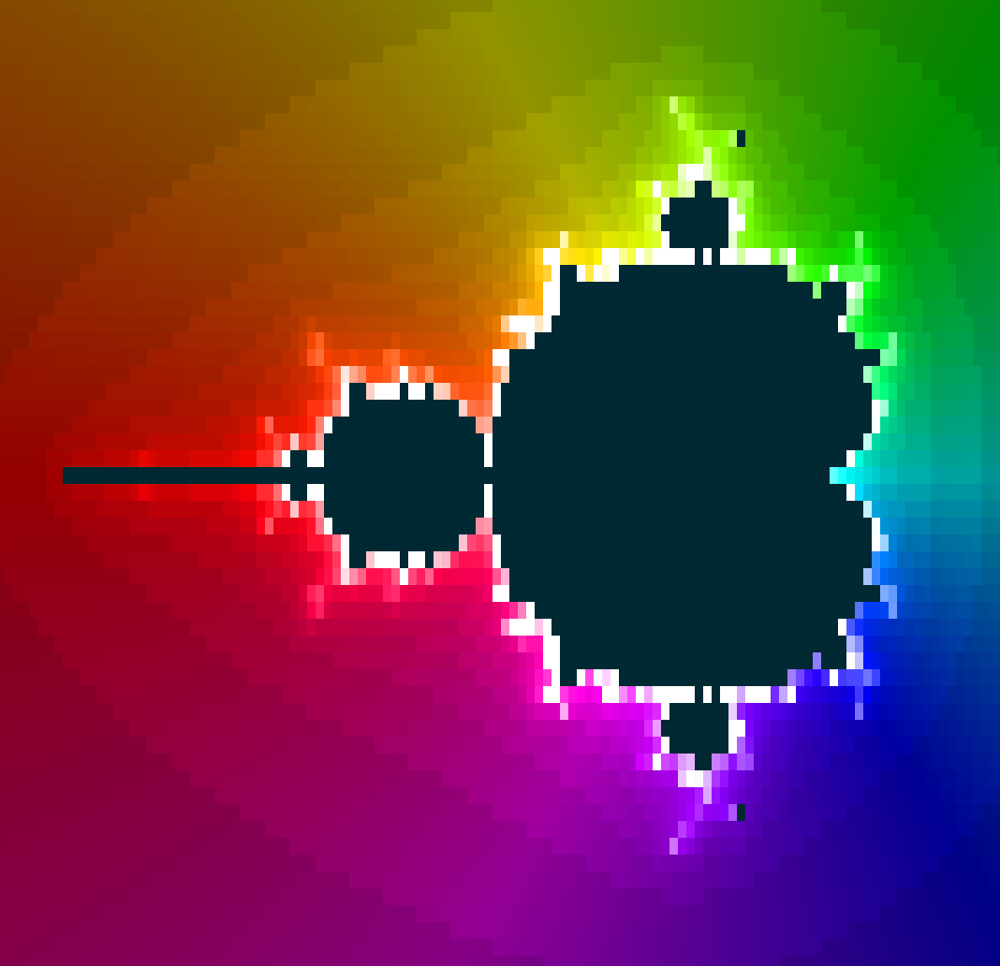

Render the Mandelbrot set in a terminal using ANSI colour codes (I was bored on the train without internet access).



### Conversation with ChatGPT

In a single sentence, what does this code do?

```
#include <cassert>
#include <complex>
#include <iostream>
#include <string>
#include <tuple>

using namespace std;

tuple<int, int, int> hsl(double h, double s, double l)
{
    auto fracMod = [](double x, int n) {
        auto y = trunc(x);
        return double(int(y) % n) + (x - y);
    };
    auto a = s * min(l, 1 - l);
    auto k = [&](int n) {
        return fracMod(n + h / 30.0, 12.0);
    };
    auto f = [&](int n) {
        return l - a * max(-1.0, min(min(k(n) - 3.0, 9.0 - k(n)), 1.0));
    };
    auto g = [&](int n) {
        return int(255.0 * max(0.0, min(255.0, f(n))));
    };
    return make_tuple(g(0), g(8), g(4));
}

int main(int argc, char* argv[])
{
    const auto MAX_K = 500;
    const auto PI = 3.1415;
    const auto OFFSET_X = -0.7;
    const auto OFFSET_Y = 0.0;

    if (argc != 4) {
        return 1;
    }

    auto size = atoi(argv[1]);
    auto scale = atoi(argv[2]);
    auto kmult = atoi(argv[3]);

    for (int i = 0; i < size; ++i) {
        for (int j = 0; j < size * 2; ++j) {
            auto c = complex(
                    OFFSET_X + (double(j) - size) / double(scale) / 2.0,
                    OFFSET_Y + (double(i) - size / 2.0) / double(scale)
            );
            auto x = complex(0.0, 0.0);
            int k = 0;
            for (; k < MAX_K; ++k) {
                x = x * x + c;
                if (abs(x) > pow(10.0, 12.0)) {
                    break;
                }
            }
            if (k == MAX_K) {
                cout << " ";
            } else {
                auto l = 0.1 + 0.9 * min(1.0, double(k * kmult) / MAX_K);
                auto h =  (arg(c) + PI) * 360.0 / (2 * PI);
                auto [r, g, b] = hsl(h, 1.0, l);
                cout << "\033[48;2;" << r << ";" << g << ";" << b << "m \033[0m";
            }
        }
        cout << endl;
    }

    return 0;
}
```

> This code generates a Mandelbrot set fractal image with variable size, scale,
> and coloring, and outputs it to the console using ANSI escape codes for colored
> output.

If you were allowed a second sentence, what would it be?

> The coloring is based on the hue, saturation, and lightness (HSL) color model,
> where the hue is determined by the angle of the complex number in the complex
> plane and the lightness is determined by the number of iterations required to
> escape the Mandelbrot set.
